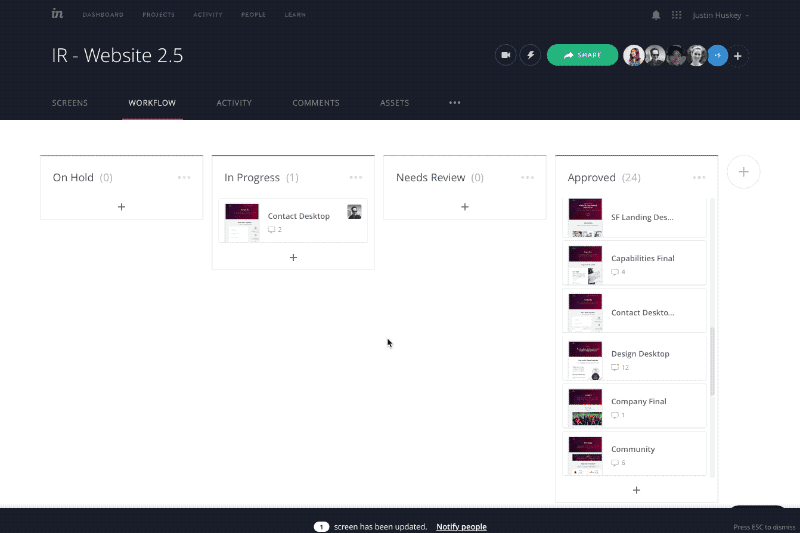

# Harvest Time Tracking Integration with Invision Enterprise workflow screens

Install this User Script via TamperMonkey to add the [Harvest Tracker Plugin](https://www.getharvest.com/add-time-tracking) to Invision Enterprise workflow pages

## Requirements

* You must have an Enterprise account set up for [Invision](https://www.invisionapp.com) and be logged in.
* You must have an account with [Harvest](https://www.getharvest.com/) and be logged in.

## Install TamperMonkey

* For Chrome users, install [TamperMonkey for Chrome](https://tampermonkey.net/?ext=dhdg&browser=chrome)
* For Safari users, install [TamperMonkey for Safari](https://tampermonkey.net/?ext=dhdg&browser=safari)
* For FireFox users, install [TamperMonkey for FireFox](https://tampermonkey.net/?ext=dhdg&browser=firefox)
* For Microsoft Edge users, install [TamperMonkey for Microsoft Edge](https://tampermonkey.net/?ext=dhdg&browser=edge)
* For other browser users, select the appropriate tab for [TamperMonkey](https://tampermonkey.net/)

## Install Script

After installing TamperMonkey, open [harvest_invisionapp_integration.user.js](https://github.com/infinitered/harvest-invision-integration/blob/master/harvest_invisionapp_integration.user.js) and click the 'Raw' button.
This will open an install screen for Tampermonkey with an Install button. Click it to install the script.

## Premium Support

[Harvest InVision Integration](https://github.com/infinitered/harvest-invision-integration), as an open source project, is free to use and always will be. [Infinite Red](https://infinite.red/) offers premium Harvest InVision Integration support and general mobile app design/development services. Email us at [hello@infinite.red](mailto:hello@infinite.red) to get in touch with us for more details.
